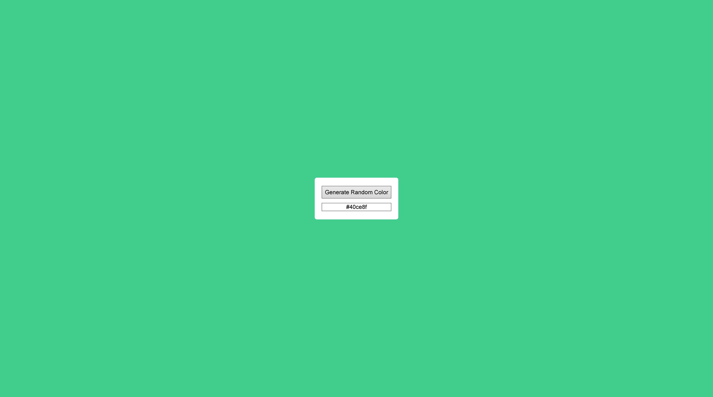
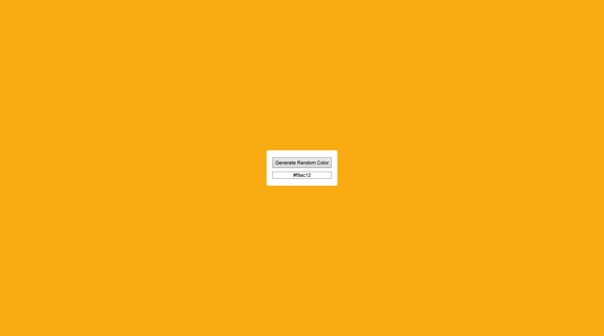

# 🎨 Random Color Generator

A simple JavaScript-based app that generates a random background color and displays its HEX value. The HEX code can be copied to clipboard with one click.

---

## 🖼️ Preview




---

## 📁 Project Structure

```
random-color-generator/
│
├── app.js             # Main JavaScript logic
├── style.css          # Stylesheet
├── random color.html  # Main HTML file
└── README.md
```

---

## 🚀 How to Run

### ✅ Requirements

- Any modern web browser
- **Visual Studio Code** with the [Live Server extension](https://marketplace.visualstudio.com/items?itemName=ritwickdey.LiveServer)

### ▶️ Steps

1. Clone or download the repository.
2. Open the project folder in **VS Code**.
3. Right-click on `random color.html` and select **"Open with Live Server"**.
4. A new browser tab will open at `http://127.0.0.1:5500/` (or similar).
5. Click the **Generate Random Color** button to see a new background and HEX color code.

---

## 🧠 Features

- Random HEX color generator
- Live background preview
- Click-to-copy HEX code to clipboard
- Smooth transition animation

---

## 📬 Contact

Created by **Jarosław Baumgart**  
📧 jaroslawbaumgart@gmail.com  
🔗 [GitHub: Jaroslaw-Baumgart](https://github.com/Jaroslaw-Baumgart)

---

## 📜 License

This project is licensed under the **MIT License**.
